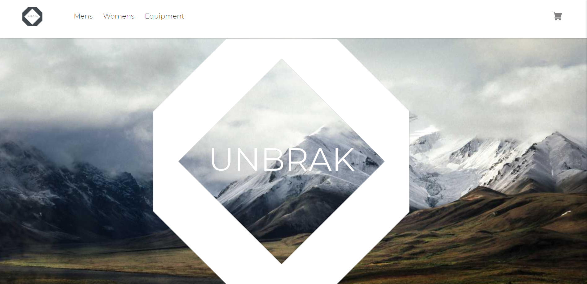
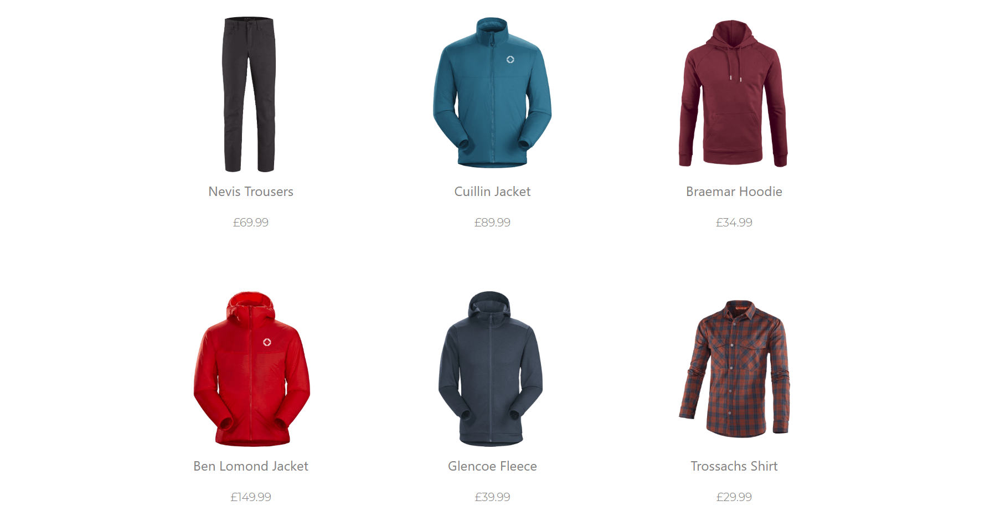
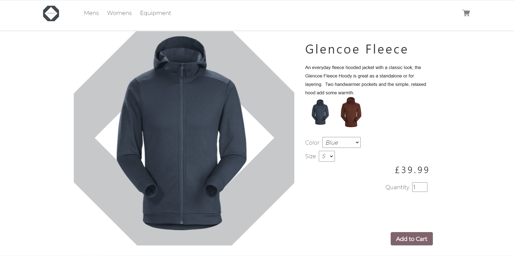
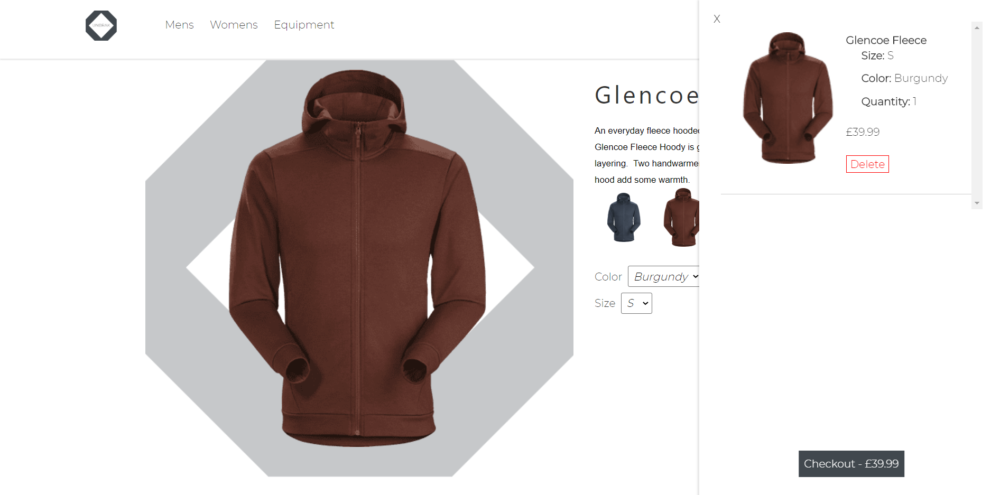
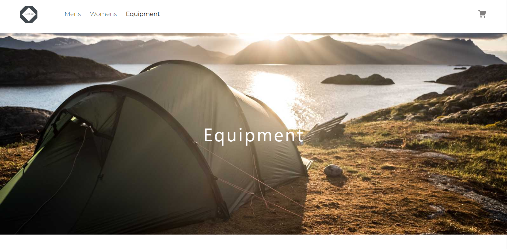
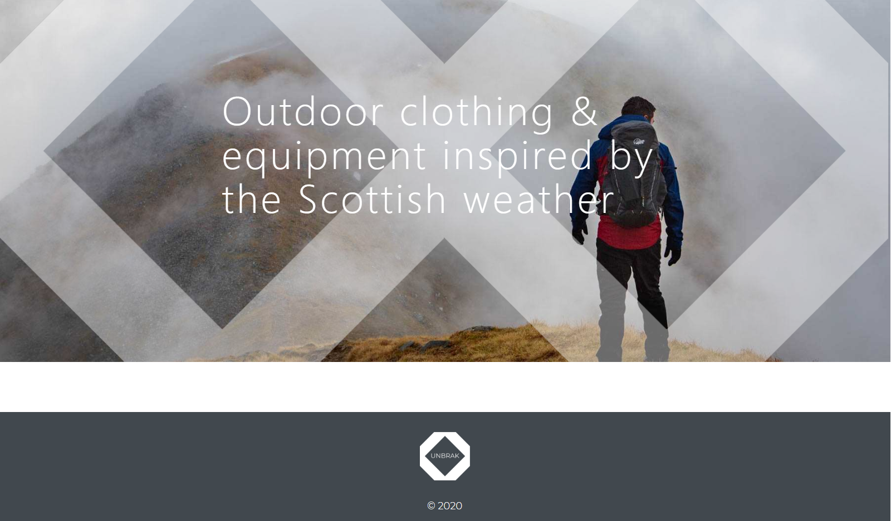

# Unbrak Outdoor
## Ecommerce Website Selling Outdoor Clothing & Equipment

[View the Website](https://dazzling-albattani-b46c1b.netlify.app/)

Unbrak Outdoor is a practice ecommerce site built using GatsbyJS & Shopify.  

---

The products are queried in the Shopify API using graphQL.

---

The product display has options for each variant that can be selected using dropdown menus and then added to the shopping cart.  Selecting the thumbnail images can also select the colour of product.

---

The shopping cart is built using React's context API which allows the shopping cart data to be available easily throughout the website.  The checkout is provided by Shopify and redirects to an external page.

---

---

---

Built using:

* GatsbyJS
* Shopify
* Responsive Design
* SEO
* GraphQL
* Javascript/ES6
* Adobe XD

